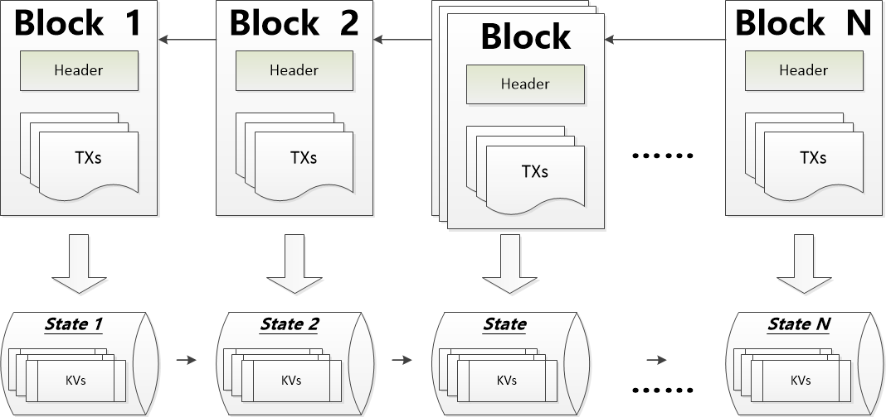

# 智能合约概述

BCBChain从 ```V2.0``` 版开始支持独立开发与部署智能合约，智能合约采用 ```golang``` 进行开发。


## 1. 简单的智能合约

### 1.1 存储

让我们先看一个最简单的智能合约。

```
package mystorage

import (
	"blockchain/smcsdk/sdk"
)

//MyStorage a demo contract
//@:contract:mystorage
//@:version:1.0
//@:organization:orgBtjfCSPCAJ84uQWcpNr74NLMWYm5SXzer
//@:author:b37e7627431feb18123b81bcf1f41ffd37efdb90513d48ff2c7f8a0c27a9d06c
type MyStorage struct {
	sdk sdk.ISmartContract

	//@:public:store
	storedData uint64
}

//InitChain init when deployed on the blockchain first time
//@:constructor
func (ms *MyStorage) InitChain() {
}

//Set set a data to the stored data
//@:public:method:gas[100]
func (ms *MyStorage) Set(data uint64) {
	ms._setStoredData(data)
}

//Get get the stored data
//@:public:method:gas[100]
func (ms *MyStorage) Get() uint64 {
	return ms._storedData()
}
```

BCBChain的智能合约就是一组代码（合约的函数）和数据（合约的状态数据）以及一组标记（合约的元数据），它位于BCBChain的一个特定地址上。


代码段：

```
package mystorage
```

声明智能合约代码包的名称，开发者可以自由设定，只需要符合 ```golang``` 标准即可。


代码段：

```
import (
	"blockchain/smcsdk/sdk"
)
```

声明智能合约需要引入的代码包，上述代码引入了BCBChain发布的智能合约 ```SDK``` 的相关代码包，在开发智能合约时需要在 ```GOPATH``` 中配置智能合约 ```SDK``` 的路径。


代码段：

```
//MyStorage a demo contract
//@:contract:mystorage
//@:version:1.0
//@:organization:orgBtjfCSPCAJ84uQWcpNr74NLMWYm5SXzer
//@:author:b37e7627431feb18123b81bcf1f41ffd37efdb90513d48ff2c7f8a0c27a9d06c
type MyStorage struct {
	sdk sdk.ISmartContract

	//@:public:store
	storedData uint64
}
```

声明智能合约的元数据以及状态数据。

* 注释行  ```//MyStorage a demo contract```  对下面定义的合约进行注释。
* 标记行  ```//@:contract:mystorage```  声明下面定义的数据结构  ```MyStorage```  代表一个智能合约，同时声明该智能合约的名称为  ```mystorage```，合约名称是将智能合约代码部署到BCBChain主链上的时候需要提供的名称，同一个组织开发的不同智能合约的合约名称不能相同，请智能合约的开发者进行合理的规划。
* 标记行  ```//@:version:1.0```  声明智能合约的代码版本。
* 标记行  ``` //@:organization:orgBtjfCSPCAJ84uQWcpNr74NLMWYm5SXzer```  标识智能合约所属的组织，示例中的组织对应的组织名称为： ```example```。
* 标记行   ```//@:author:b37e7627431feb18123b81bcf1f41ffd37efdb90513d48ff2c7f8a0c27a9d06c```  标识智能合约的开发者公钥。
	 代码行  ```type MyStorage struct {```  声明智能合约的数据结构开始，智能合约的函数与状态数据都是该数据结构下的成员。代码行  ```	sdk sdk.ISmartContract```  表示该数据结构是遵循BCBChain智能合约SDK的智能合约，将自动聚合SDK提供的智能合约访问上下文（变量名必须定义为sdk）。
* 标记行  ``` //@:public:store```  表示下一行代码将声明一个状态数据。
* 代码行  ``` storedData uint64```  声明一个类型为```uint64```的状态变量，变量名为```storedData```，你可以认为它是状态数据库里的一个位置，可以通过调用管理数据库的函数进行查询和变更，从外部访问状态数据库中的这个变量的KEY值为```    /orgBtjfCSPCAJ84uQWcpNr74NLMWYm5SXzer/mystorage/storedData```。BCBChain提供的辅助工具将会为该状态变量自动封装并生成访问函数```_storeData() uint64```、```_setStoreData(uint64)```、```_chkStoreData() bool```和```_delStoreData() bool```。
* 代码行  ```}```  表示智能合约数据结构定义完成。


代码段：

```
//InitChain init when deployed on the blockchain first time
//@:constructor
func (ms *MyStorage) InitChain() {
}
```

声明智能合约的上链初始化代码（只在第一次部署时执行，升级合约时将执行另一个初始化代码 ```UpdateChain```，在本合约中不需要定义）。

- 标记行  ```//@:constructor```  声明下面定义的函数 ```InitChain()``` 是一个智能合约的标准区块链初始化函数，在BCBChain上第一次部署这个合约的时候自动进行唯一一次调用，以完成智能合约在区块链上的初始化工作，例如初始化某些全局状态变量的初始值。
- 代码行  ```func (ms *MyStorage) InitChain() {```  声明智能合约上链初始化的函数原型，函数名必须为```InitChain```，该函数没有输入参数。
- 代码行  ```} ```  表示智能合约上链初始化的函数实现完成。


代码段：

```
//Set set a data to the stored data
//@:public:method:gas[100]
func (ms *MyStorage) Set(data uint64) {
	ms._setStoredData(data)
}
```

声明智能合约的代码。

* 标记行  ```//@:public:method:gas[100]```  声明下面定义的函数 ```Set()``` 是一个智能合约的公共函数，可以通过BCBChain交易广播的方式进行调用，并将调用信息及结果记录在区块链上，同时声明对该函数的调用将消耗的燃料为100。
* 代码行  ```func (ms *MyStorage) Set(data uint64) {```  声明一个智能合约的函数原型。代码行  ```    ms._setStoredData(data)```  为该函数的实现代码，表示将输入的参数保存到状态变量```storedData```中。
* 代码行  ```}```  表示智能合约函数实现完成。


代码段：

```
//Get get the stored data
//@:public:method:gas[100]
func (ms *MyStorage) Get() uint64 {
	return ms._storedData()
}
```

声明智能合约的代码。

* 标记行  ```//@:public:method:gas[100]```  声明下面定义的函数  ```Get()```  是一个智能合约的公共函数，可以通过BCBChain交易广播的方式进行调用，并将调用信息及结果记录在区块链上，同时声明对该函数的调用将消耗的燃料为100。
* 代码行  ```func (ms *MyStorage) Get() uint64 {```  声明一个智能合约的函数原型。代码行  ```    return ms._storedData()```  为该函数的实现代码，表示将读取状态变量```storedData```的值并返回给调用者。
* 代码行  ```}```  表示智能合约函数实现完成。


该合约能完成的事情并不多：它能允许任何人在合约中存储一个单独的数字，并且这个数字可以被世界上任何人访问，且没有可行的办法阻止你发布这个数字。当然，任何人都可以再次调用 ```Set``` ，传入不同的值，覆盖你的数字，但是这个数字仍会被存储在区块链的历史记录中。随后，我们会看到怎样施加访问限制，以确保只有你才能改变这个数字。


备注：

* 智能合约代码所有的标识符（合约名称，函数名称和变量名称）都只能使用```ASCII```字符集。
* 智能合约代码要求使用```ASSCII```或```UTF-8```编码的形式存储。


### 1.2 代币

下面的合约实现了一个最简单的加密代币。在这里，代币确实可以无中生有地产生，但是只有合约的拥有者才能做到，而且，任何人都可以给其他人转币，不需要注册用户名和密码 —— 所需要的只是符合 BCBChain 规范的密钥对。

```
package mycoin

import (
	"blockchain/smcsdk/sdk"
	"blockchain/smcsdk/sdk/bn"
	"blockchain/smcsdk/sdk/types"
)

//Mycoin a demo contract for digital coin
//@:contract:mycoin
//@:version:1.0
//@:organization:orgBtjfCSPCAJ84uQWcpNr74NLMWYm5SXzer
//@:author:b37e7627431feb18123b81bcf1f41ffd37efdb90513d48ff2c7f8a0c27a9d06c
type Mycoin struct {
	sdk sdk.ISmartContract

	//@:public:store:cache
	totalSupply bn.Number

	//@:public:store
	balanceOf map[types.Address]bn.Number
}

const oneToken int64 = 1000000000

//InitChain init when deployed on the blockchain first time
//@:constructor
func (mc *Mycoin) InitChain() {
  thisContract := mc.sdk.Helper().ContractHelper().ContractOfName("mycoin")
  totalSupply := bn.N1(1000000, oneToken)
  mc._setTotalSupply(totalSupply)
  mc._setBalanceOf(thisContract.Owner().Address(), totalSupply)
}

//@:public:receipt
type receipt interface {
	emitTransferMyCoin(token, from, to types.Address, value bn.Number)
}

//Transfer transfer coins from sender to another
//@:public:method:gas[500]
//@:public:interface:gas[450]
func (mc *Mycoin) Transfer(to types.Address, value bn.Number) {
	sdk.Require(value.IsPositive(),
		types.ErrInvalidParameter, "value must be positive")

	sender := mc.sdk.Message().Sender().Address()
	newBalanceOfSender := mc._balanceOf(sender).Sub(value)
	sdk.Require(newBalanceOfSender.IsGEI(0),
		types.ErrInsufficientBalance, "")

	receiver := to
	newBalanceOfReceiver := mc._balanceOf(receiver).Add(value)

	mc._setBalanceOf(sender, newBalanceOfSender)
	mc._setBalanceOf(receiver, newBalanceOfReceiver)

	mc.emitTransferMyCoin(
		mc.sdk.Message().Contract().Address(),
		sender,
		receiver,
		value)
}
```

这个合约引入了一些新的概念，下面逐一解读。


代码段：

```
	//@:public:store:cache
	totalSupply bn.Number
```

声明智能合约的状态数据。

- 标记行  ```    //@:public:store:cache```  表示下一行代码将声明一个状态数据，该状态数据将会在内存中进行缓存。
- 代码行  ```    totalSupply bn.Number```  声明一个类型为```bn.Number```的状态变量，变量名为```totalSupply ```，```bn.Number```类型表示一个带符号的大数，进行加减乘除操作时不必考虑溢出的问题，从外部访问状态数据库中的这个变量的KEY值为```    /orgBtjfCSPCAJ84uQWcpNr74NLMWYm5SXzer/mycoin/totalSupply ```。BCBChain提供的辅助工具将会为该变量自动封装并生成访问函数```_totalSupply() bn.Number```、```_setTotalSupply(bn.Number)```、```_chkTotalSupply() bool```和```_delTotalSupply() ```，由于标记```cache```的影响，还会生成一个清除内存缓存的函数```_clrTotalSupply()```。


代码段：

```
	//@:public:store
	balanceOf map[types.Address]bn.Number
```

也声明了一个公共状态变量，但它是一个更复杂的数据类型。 该类型将地址映射为大数，用于存储拥有该种代币的账户地址对应的余额。 从外部访问状态数据库中的这个变量的KEY值为```    /orgBtjfCSPCAJ84uQWcpNr74NLMWYm5SXzer/mycoin/balanceOf/address```，其中```address```为实际要查询的账户地址。BCBChain提供的辅助工具将会为该变量自动封装并生成访问函数```_balanceOf(types.Address) bn.Number```、```_setBalanceOf(types.Address, bn.Number)```、```_chkBalanceOf(types.Address) bool```和```_delBalanceOf(types.Address) ```。


代码段：

```
//@:public:receipt
type receipt interface {
	emitTransferMyCoin(token, from, to types.Address, value bn.Number)
}
```

声明智能合约方法执行时发送的收据，收据将会被保存在BCBChain链中供人们查询。

* 标记行  ```//@:public:receipt```  声明下一行代码为收据接口定义。
* 代码行  ```type receipt interface {```  声明实际的收据接口类型开始，类型名称固定为 ```receipt```  。
* 代码行  ```    emitTransferMyCoin(token, from, to types.Address, value bn.Number)```  声明了一个所谓的收据（receipt），它会在 Transfer函数的最后一行被发出。用户界面（当然也包括服务器应用程序）可以监听BCBChain链上正在发送的收据，而不会花费太多成本。一旦它被发出，监听该收据的```listener```都将收到通知，可方便追踪交易。
* 代码行  ```}```  表示收据接口定义完成。


代码段：

```
//Transfer transfer coins from sender to another
//@:public:method:gas[500]
//@:public:interface:gas[450]
func (mc *Mycoin) Transfer(to types.Address, value bn.Number) {
    .
    .
    .
}
```

声明智能合约的代码。

* 标记行  ```//@:public:interface:gas[450]```  声明下面定义的函数  ```Transfer()```  是一个智能合约的公共接口，可以通过智能合约之间相互进行跨合约调用的机制进行调用，并将调用信息及结果记录在BCBChain链上。同一组织在BCBChain上部署的智能合约之间可以进行相互调用，BCBChain基础组织部署的智能合约所提供的公共接口可以由任意智能合约进行调用。


代码段：

```
  sdk.RequireAddress(to)
  sdk.Require(value.IsPositive(),
		types.ErrInvalidParameter, "value must be positive")
```

声明一段合约代码逻辑。函数 ```sdk.RequireAddress()```  由SDK提供用于检测输入参数``` to```是否是一个标准的账户地址，如果不满足则自动结束合约的执行，并返回相应的错误信息。函数 ```sdk.Require()```  由SDK提供，用于检测某个条件必须成立(此处是检测输入参数```value```必须大于0)，否则自动结束合约的执行，并返回相应的错误信息。


代码段：

```
  sender := mc.sdk.Message().Sender().Address()
  newBalanceOfSender := mc._balanceOf(sender).Sub(value)
  sdk.Require(newBalanceOfSender.IsGEI(0),
		types.ErrInsufficientBalance, "")
```

声明一段合约代码逻辑。函数 ```mc.sdk.Message().Sender().Address()``` 由SDK提供，用于获取消息发起者的账户地址。```mc._balanceOf(sender).Sub(value)``` 用于获取消息发起者账户地址所拥有代币的余额并减去转账金额，计算出新的账户余额，函数```_balanceOf()```是由BCBChain提供的辅助工具自动生成的。函数 ```sdk.Require()```  由SDK提供，用于检测某个条件必须成立(此处是检测转账发起者的余额足够进行转账操作)，否则自动结束合约的执行，并返回相应的错误信息。


代码段：

```
  receiver := to
  newBalanceOfReceiver := mc._balanceOf(receiver).Add(value)
```

声明一段合约代码逻辑。```mc._balanceOf(receiver).Add(value)``` 用于计算接收转账的账户地址所拥有的新的账户余额。


代码段：

```
  mc._setBalanceOf(sender, newBalanceOfSender)
  mc._setBalanceOf(receiver, newBalanceOfReceiver)
```

声明一段合约代码逻辑。用于将计算得出的新的账户余额写入状态数据库中，函数```_setBalanceOf()```是由BCBChain提供的辅助工具自动生成的。


代码段：

```
  mc.emitTransferMyCoin(
		mc.sdk.Message().Contract().Address(),
		sender,
		receiver,
		value)
```

声明一段合约代码逻辑。用于向区块链发送本次转账的收据，函数```emitTransferMyCoin()```是由BCBChain提供的辅助工具自动生成的。


这个合约提供了两个函数，函数 ```InitChain()```是在部署合约之后由BCBChain链自动调用一次，用于对合约进行初始化。 真正被用户或其他合约所调用的，以完成本合约功能的函数是```Transfer()```。 函数```Transfer()```可被任何人用于向他人发送代币 (当然，前提是发送者拥有这些代币)。记住，如果你使用合约发送代币给一个地址，当你在BCBChain链浏览器上查看该地址时是看不到任何相关信息的。因为，实际上你发送代币和更改余额的信息仅仅存储在这个合约的数据存储器中（需要使用特殊的查询手段从状态数据库进行查询）。通过使用收据，你可以非常简单地为你的新代币创建一个“区块链浏览器”来追踪交易和余额。


## 2. 区块链基础

程序员对于区块链这个概念应该并不难理解，这是因为大多数复杂的算法与协议 (哈希 ，椭圆曲线密码学 ，点对点网络（P2P） 等) 都只是用于提供特定的功能和承诺。对于智能合约开发程序员来说，只需接受这些既有的特性与功能，不必关心底层技术的实现方案。

### 2.1 交易/事务

区块链是一种全球共享的事务性数据库，这意味着每个人都可加入网络来阅读数据库中的记录。如果你想改变数据库中的某些东西，你必须创建一个被所有其他人所接受的事务（在区块链世界又被称为交易）。事务一词意味着你想做的（假设您想要同时更改两个值），要么一点没做，要么全部完成。此外，当你的事务被应用到数据库时，其他事务不能修改数据库。

举个例子，设想一张表，列出电子货币中所有账户的余额。如果你请求从一个账户转移到另一个账户，数据库的事务特性确保了如果从一个账户扣除金额，它总被添加到另一个账户。如果由于某些原因，无法添加金额到目标账户时，源账户也不会发生任何变化。

此外，交易总是由发送人（创建者）签名。这样，就可非常简单地为数据库的特定修改增加访问保护机制。在数字代币的例子中，一个简单的检查可以确保只有持有账户密钥的人才能从中转账。


### 2.2 状态

BCBChain参考了Ethereum、Fabric、Tendermint、Cosmos等开源区块链方案，借鉴了其中一些优秀思想。

BCBChain在本质上是一个基于交易的状态机(transaction-based state machine)。在计算机科学中，状态机是一个包含一组状态集（states）、一个起始状态（start state）、一组输入符号集（alphabet）、一个映射输入符号和当前状态到下一状态的转换函数（transition function）的计算模型。

在BCBChain其中状态集由状态数据库进行表达，起始状态被称为创世状态（genesis state），输入的符号集就是在区块链领域常说的交易（transaction，简称tx），状态转换函数就是智能合约。


根据BCBChain的状态机，我们从创世状态(genesis state)开始。这差不多类似于一片空白的石板，在网络中还没有任何交易产生的状态。当交易被执行后，这个创世纪状态就会转变成最终状态。在任何时刻，这个最终状态都代表着BCBChain当前的状态。


### 2.3 区块

BCBChain的状态由成千上万个交易达成。这些交易都被 “组团” 到一个个区块中。一个区块包含了一系列的交易，每个区块都与它的前一个区块链接起来，这正是“区块链”这个词的来源，每一个区块都会导致状态机达到一个新的状态。



为了让一个状态转换成下一个状态，交易必须是有效的（也就是促使采用区块链技术的不可抵赖特性需求）。为了让一个交易被认为是有效的，它必须要经过一个验证过程，每一个交易都必须由交易发起人通过自己的私钥进行签名，并且在BCBChain的智能合约中校验满足一定的条件，才能被认为是有效的。


### 2.4 调用

智能合约可以通过消息调用的方式来调用其它智能合约。

每个交易都可以包含多个按顺序执行的顶层消息调用，前一个消息调用的输出收据可以作为下一个顶层消息调用的

输入，在下一个顶层消息调用中执行一些逻辑处理代码。每一个顶层消息调用，这个消息调用会依次产生更多的跨合约的消息调用。

消息调用层数被限制为8层，为了预防死循环，各层消息调用不能形成环路。


### 2.5 收据

每一个消息调用除了返回结果以外，还可以返回执行合约业务逻辑过程中的日志数据，在这里我们把它称为收据，这些收据数据保存在区块上，可以很方便的进行检索。


